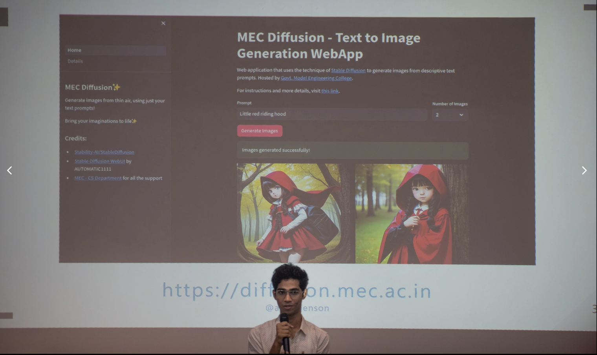

# LLM Workshop

I got invited as a speaker to conduct a 6 hour LLM Workshop for FOSS Meet'24 at NIT Calicut in the end of March.

It was nice.

There was Kurian Benoy and Nithin Sabu as co-speakers to help as well.

Met some cool people over there as well.

<figure><figcaption></figcaption></figure>

<figure><figcaption></figcaption></figure>

<figure><figcaption>
With my trusty ol' Thinkpad
</figcaption></figure>

<figure><figcaption>
Cool friends I've come to know over the years.
</figcaption></figure>

<figure><figcaption></figcaption></figure>

&#x20;

<figure><figcaption></figcaption></figure>

<figure><figcaption></figcaption></figure>

