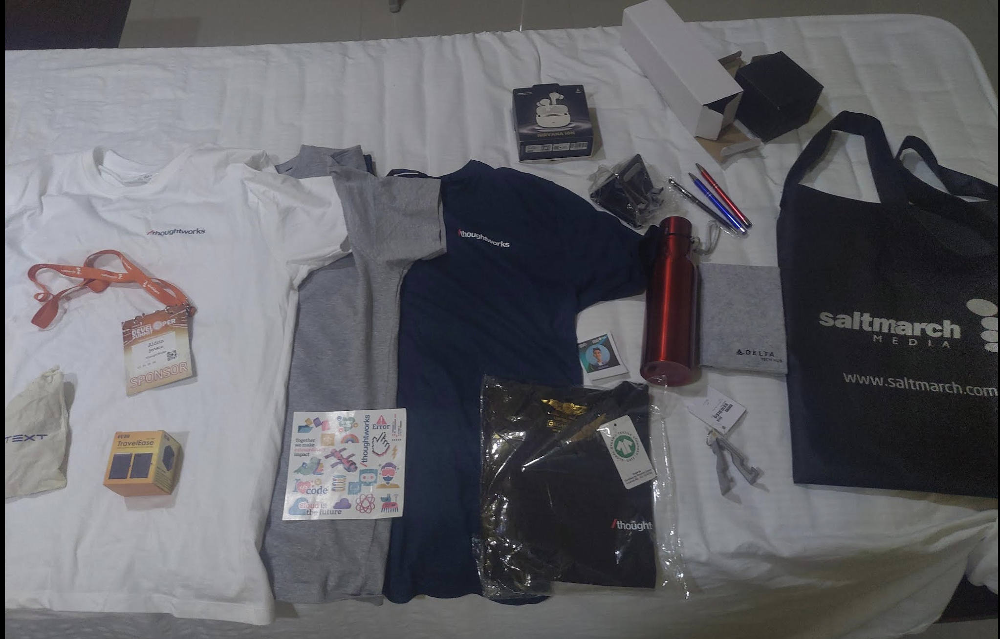

# Speaking at MEC.Conf

This was one of the great memories!

I was invited to give a talk on Free and Open Source Software (FOSS) to an audience of around 150 people.

At first I was very hesitant. I gave the volunteers the contact number of a lot of other people. Still, in the end it came back to me due to multiple reasons. I spent days making a good presentation.

And it paid off! it paid off big time!!

This was one of the happiest moments. At the end of the talk, I got such great feedback that I was very proud and happy!

I talked about FOSS, the origins, the 4 freedoms, why one should care, how to get started etc. This was a topic that was very close to my heart.

​​​.png>).png>)

<figure><figcaption>
Me showing how Open Source helped me build one of the most used project of mine - MEC Diffusion​
</figcaption></figure>

<figure><figcaption></figcaption></figure>

<figure><figcaption>
With Iqbal and the organizing team
</figcaption></figure>

I was heavily inspired by a good friend Abraham Raji and a lot of very enthusiastic people from the FOSS community, because of which all the effort put into the talk felt very much worth it.

I used several real-life examples and analogies (the 4 Freedoms through a Masala Dosa example) to make the concepts much clearer and more relatable.

